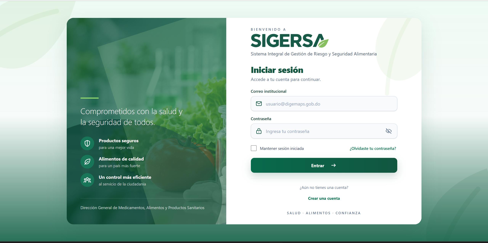
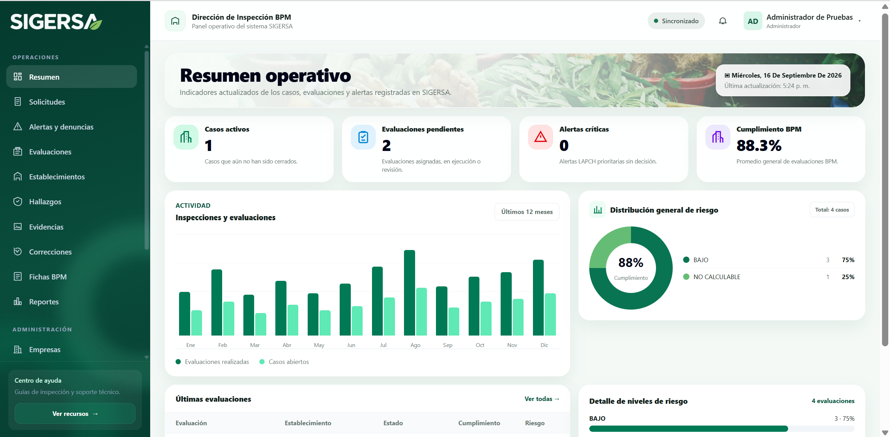
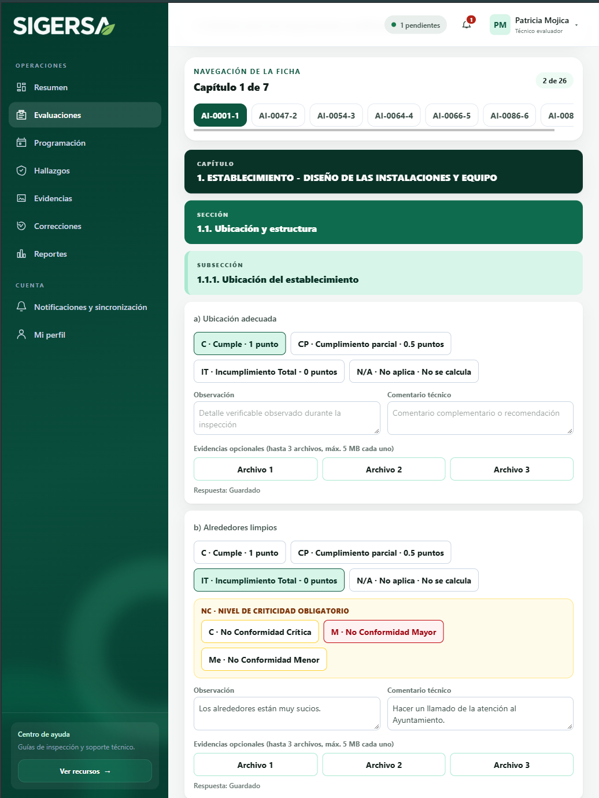
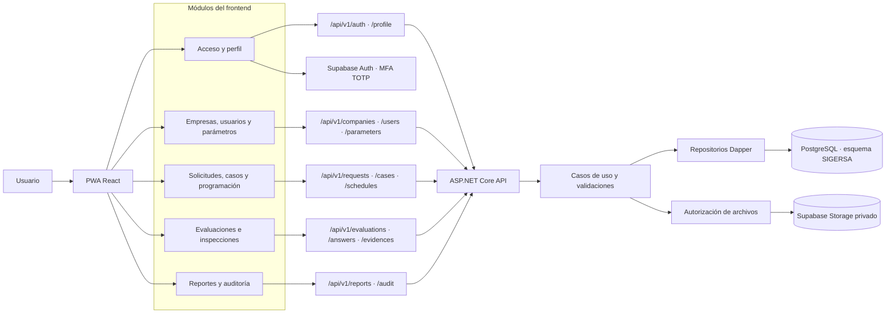

<p align="center">
  
</p>

<h1 align="center">Sistema Integral de Gestión de Riesgo y Seguridad Alimentaria</h1>

<p align="center">
  Aplicación web progresiva para gestionar Evaluaciones Basadas en Riesgo e inspecciones de Buenas Prácticas de Manufactura (EBR/BPM).
</p>

SIGERSA centraliza solicitudes, alertas y denuncias, casos, programación, inspecciones, evidencias, hallazgos, correcciones, cálculo de riesgo, informes y trazabilidad histórica. La interfaz está diseñada con enfoque móvil primero y puede continuar el trabajo de campo sin conexión para sincronizarlo al recuperar conectividad.

## Vistas del sistema

### Acceso



### Resumen operativo



### Inspección BPM



## Capacidades principales

- Autenticación JWT con renovación de sesión, bloqueo por intentos y recuperación de contraseña mediante OTP.
- MFA TOTP opcional integrado con Supabase Auth.
- Registro público de Administradores de Empresa y Usuarios Delegados con carta de autorización.
- Control de acceso por rol, empresa, asignación y propiedad del recurso.
- Gestión de empresas, establecimientos, usuarios, parámetros y catálogos.
- Operación conectada de solicitudes, alertas, casos, programación, evaluaciones, hallazgos, evidencias y correcciones.
- Fichas BPM dinámicas, jerárquicas y versionadas, con cálculo de cumplimiento y riesgo.
- Hasta tres evidencias por ítem de inspección, con un máximo de 5 MB por archivo.
- Informes PDF, auditoría, perfil de usuario y notificaciones.
- Soporte PWA y cola offline idempotente mediante IndexedDB.
- Almacenamiento privado de archivos en Supabase Storage.

## Módulos y acceso por rol

Las páginas públicas son **Inicio**, **Inicio de sesión**, **Registro** y **Recuperación de contraseña**. Los módulos autenticados se habilitan según la siguiente matriz; además, cada endpoint vuelve a validar el ámbito y la propiedad del recurso.

| Módulo | Administrador | Administrador de empresa | Usuario delegado | Coordinador | Técnico evaluador | Laboratorista |
| --- | :---: | :---: | :---: | :---: | :---: | :---: |
| Resumen | ✓ | ✓ | ✓ | ✓ | ✓ |  |
| Solicitudes | ✓ |  | ✓ | ✓ |  |  |
| Alertas y denuncias | ✓ |  |  | ✓ |  | ✓ |
| Casos |  |  |  | ✓ |  |  |
| Programación |  |  |  | ✓ | ✓ |  |
| Evaluaciones | ✓ |  |  | ✓ | ✓ |  |
| Establecimientos | ✓ |  |  |  |  |  |
| Hallazgos | ✓ |  |  | ✓ | ✓ |  |
| Evidencias | ✓ |  |  | ✓ | ✓ |  |
| Correcciones | ✓ |  |  | ✓ | ✓ |  |
| Fichas BPM | ✓ |  |  |  |  |  |
| Reportes | ✓ |  | ✓ | ✓ | ✓ |  |
| Empresas | ✓ |  |  |  |  |  |
| Gestión de usuarios | ✓ | ✓* |  |  |  |  |
| Parámetros | ✓ |  |  |  |  |  |
| Auditoría | ✓ |  |  |  |  |  |
| Mi perfil | ✓ | ✓ | ✓ | ✓ | ✓ | ✓ |
| Notificaciones y sincronización | ✓ | ✓ | ✓ | ✓ | ✓ | ✓ |

\* El Administrador de Empresa solo administra usuarios de su propia empresa y no puede asignar roles internos o globales.

Los códigos canónicos son `ADMINISTRADOR`, `ADMINISTRADOR_EMPRESA`, `USUARIO_DELEGADO`, `COORDINADOR`, `TECNICO_EVALUADOR` y `LABORATORISTA`.

### Evaluaciones e inspecciones: un solo espacio de trabajo

El módulo **Evaluaciones** concentra la creación, el inicio, la ejecución de la inspección, la revisión, la aprobación y el cierre. Una evaluación en estado `EN_EJECUCION` permite realizar la inspección al Técnico Evaluador autorizado. El Administrador y el Coordinador pueden consultar la ficha según sus permisos, mientras que el acceso histórico conserva las respuestas y la línea de tiempo. La antigua dirección del módulo Inspecciones se mantiene como acceso compatible y redirige a Evaluaciones.

## Arquitectura y tecnologías

- **Frontend:** React 19, TypeScript 6, Vite 8, Tailwind CSS 4 y React Router DOM 7.
- **PWA y trabajo offline:** Service Worker, Dexie e IndexedDB con sincronización idempotente.
- **Backend:** .NET 10 Web API, Clean Architecture, REST y Problem Details.
- **Persistencia:** PostgreSQL 15 o superior, Dapper y Npgsql.
- **Archivos:** Supabase Storage privado; PostgreSQL conserva metadatos, hashes y referencias.
- **Autenticación y autorización:** JWT, refresh tokens rotativos, MFA TOTP, BCrypt, RBAC y validación de ámbito.
- **Informes:** PDFsharp y PuppeteerSharp.
- **Calidad:** xUnit, Vitest, Testing Library, ESLint, Prettier y OpenAPI/Swagger.

La solución backend se divide en:

- `SIGERSA.Domain`: entidades, reglas e interfaces.
- `SIGERSA.Application`: casos de uso, contratos y validaciones.
- `SIGERSA.Infrastructure`: Dapper/Npgsql, repositorios, correo, archivos e informes.
- `SIGERSA.Api`: endpoints, autenticación, autorización, middleware y Swagger.
- `SIGERSA.Worker`: procesos en segundo plano.
- `SIGERSA.Tests`: pruebas automatizadas.

### Flujo de peticiones por módulo



> **Regla obligatoria:** todos los objetos de negocio de PostgreSQL pertenecen al esquema `SIGERSA`. No se crean tablas de negocio en `public` ni tipos `ENUM`; los catálogos administrables residen en `SIGERSA.ParametersControl`.

## Requisitos locales

- .NET SDK 10.0.301 o una versión compatible según `global.json`.
- Node.js compatible con Vite 8.
- pnpm 11.19 o compatible.
- PostgreSQL 15 o superior.
- Proyecto Supabase con Auth TOTP habilitado y un bucket privado para probar archivos reales.
- Servidor SMTP para probar recuperación OTP y notificaciones por correo.

Puertos predeterminados:

- Frontend: `http://127.0.0.1:5173`
- API: `http://localhost:5000`
- Swagger: `http://localhost:5000/swagger`
- PostgreSQL: `localhost:5432`

## Configuración local

### 1. Base de datos

```sql
CREATE DATABASE sigersa_db;
```

Aplique en orden alfabético las migraciones de `src/backend/Database/Migrations`. Actualmente hay 24 migraciones, desde `001_initial_schema_sigersa.sql` hasta `024_operational_workflow_consistency.sql`. La API no las ejecuta automáticamente.

### 2. Backend

Defina las credenciales mediante `.env.local`, variables de entorno, User Secrets o un proveedor seguro. No almacene secretos reales en archivos versionados.

```powershell
$env:Database__ConnectionString = "Host=localhost;Port=5432;Database=sigersa_db;Username=postgres;Password=SU_CLAVE"
$env:Authentication__Jwt__SigningKey = "UNA_CLAVE_LOCAL_SEGURA_DE_AL_MENOS_32_CARACTERES"
$env:Supabase__Url = "https://SU_PROYECTO.supabase.co"
$env:Supabase__Key = "SU_CLAVE_SECRETA_COMPLETA_DEL_SERVIDOR"
$env:Supabase__DefaultBucketName = "SIGERSA_FILES"
$env:Smtp__Enabled = "true"
$env:Smtp__Host = "smtp.su-proveedor.com"
$env:Smtp__Port = "587"
$env:Smtp__EnableSsl = "true"
$env:Smtp__Username = "SU_USUARIO"
$env:Smtp__Password = "SU_CLAVE_SMTP"
$env:Smtp__FromAddress = "no-reply@su-dominio.com"
```

`Supabase__Key` es exclusiva del backend. Para MFA, habilite el proveedor de correo y contraseña y la verificación TOTP en **Authentication** de Supabase.

### 3. Frontend

Copie `src/frontend/.env.example` como `src/frontend/.env.local` y complete únicamente valores públicos:

```dotenv
VITE_API_BASE_URL=http://127.0.0.1:5000
VITE_SUPABASE_URL=https://SU_PROYECTO.supabase.co
VITE_SUPABASE_PUBLISHABLE_KEY=SU_CLAVE_PUBLICABLE_O_ANON
VITE_SUPABASE_EVIDENCE_BUCKET=SIGERSA_FILES
```

La clave del frontend debe ser publicable o `anon`, nunca una clave secreta del servidor.

## Instalación y ejecución

Abra PowerShell en la raíz de `SIGERSA`. En la primera instalación, restaure el backend e instale el frontend:

```powershell
dotnet restore src/backend/SIGERSA.sln --configfile NuGet.Config
Set-Location src/frontend
pnpm install
```

Ejecute la API:

```powershell
dotnet run --project src/backend/SIGERSA.Api --launch-profile http
```

En otra terminal, ejecute la PWA:

```powershell
Set-Location src/frontend
pnpm dev --host 127.0.0.1 --port 5173
```

Después abra `http://127.0.0.1:5173`. El acceso directo está disponible en `http://127.0.0.1:5173/acceso.html`.

Si PowerShell bloquea `pnpm.ps1`, puede habilitar los scripts solo para la sesión actual:

```powershell
Set-ExecutionPolicy -Scope Process -ExecutionPolicy Bypass -Force
```

## Validación y pruebas

Backend:

```powershell
dotnet test src/backend/SIGERSA.sln
dotnet format src/backend/SIGERSA.sln --verify-no-changes
```

Frontend:

```powershell
Set-Location src/frontend
pnpm format:check
pnpm lint
pnpm typecheck
pnpm test
pnpm build
```

## Estructura del repositorio

```text
SIGERSA/
├── docs/                              # Auditorías e informes técnicos
├── output/                            # Artefactos generados localmente
├── src/
│   ├── backend/
│   │   ├── Database/Migrations/       # Migraciones PostgreSQL
│   │   ├── SIGERSA.Api/               # API REST
│   │   ├── SIGERSA.Application/       # Casos de uso y contratos
│   │   ├── SIGERSA.Domain/            # Dominio y reglas de negocio
│   │   ├── SIGERSA.Infrastructure/    # Persistencia e integraciones
│   │   ├── SIGERSA.Tests/             # Pruebas del backend
│   │   └── SIGERSA.Worker/            # Procesos en segundo plano
│   └── frontend/                      # PWA React y recursos visuales
└── tools/                             # Utilidades y pruebas de humo
```

## Integraciones externas

Las funciones de correo, MFA y almacenamiento requieren credenciales locales válidas:

- Sin SMTP habilitado no se envían códigos OTP ni notificaciones por correo.
- Sin una clave secreta válida de Supabase, el backend no puede provisionar MFA ni confirmar cargas en el bucket privado.
- El navegador solo recibe la clave publicable de Supabase; la autorización de cargas se realiza desde la API.
