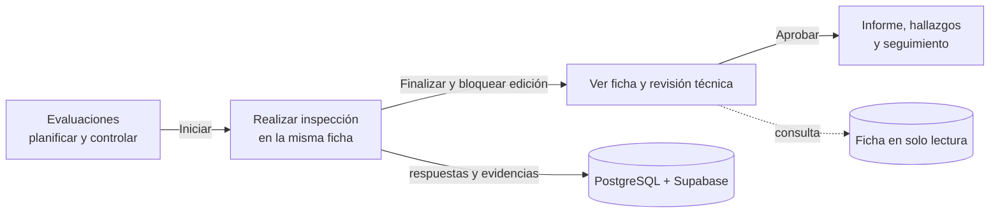
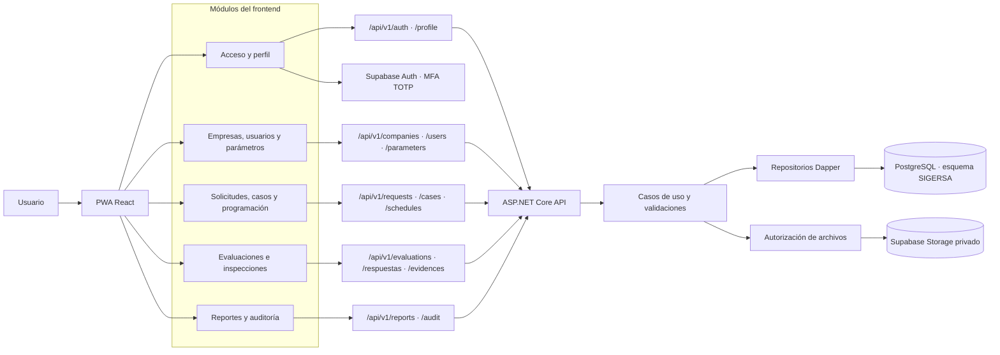
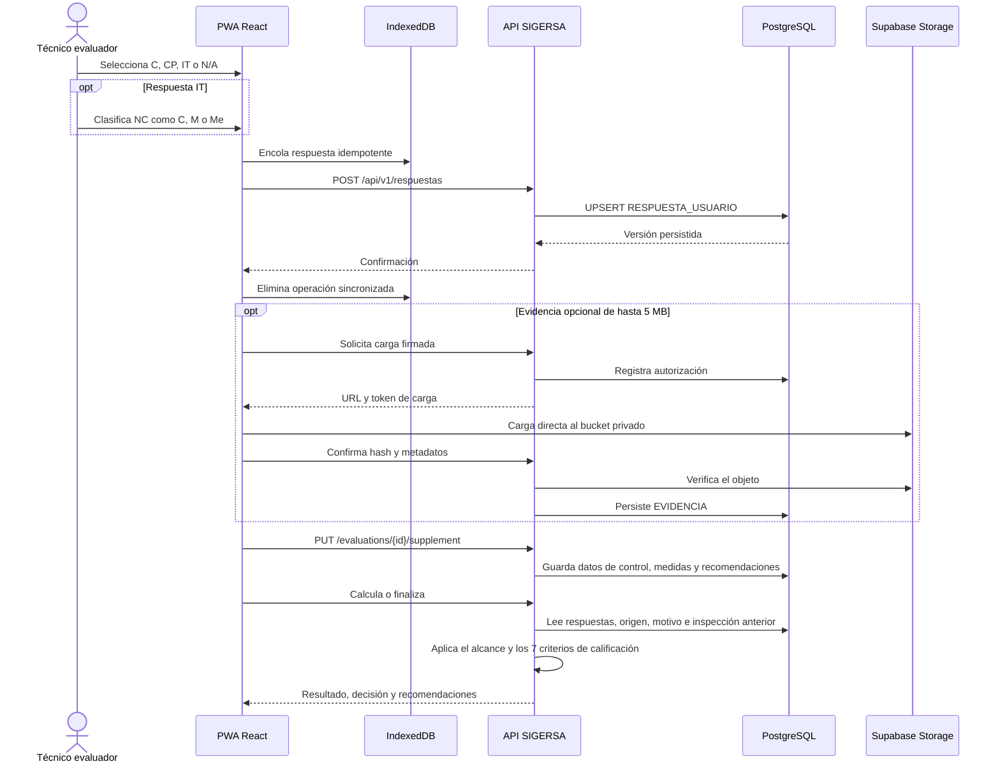
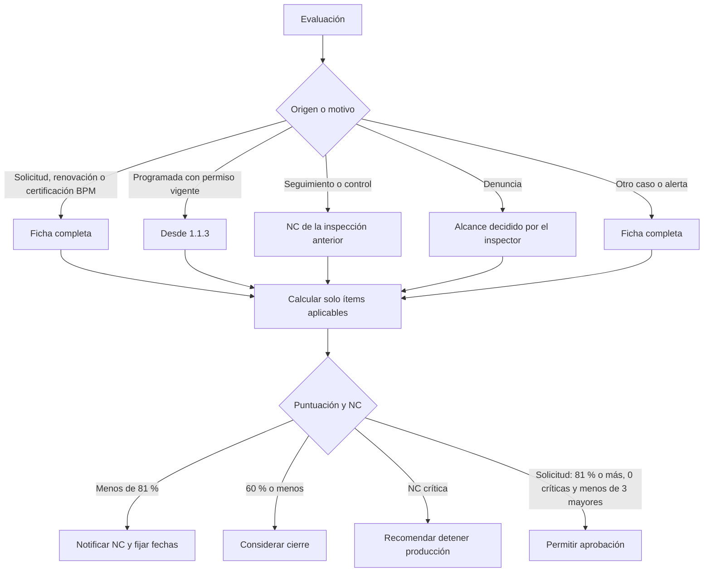
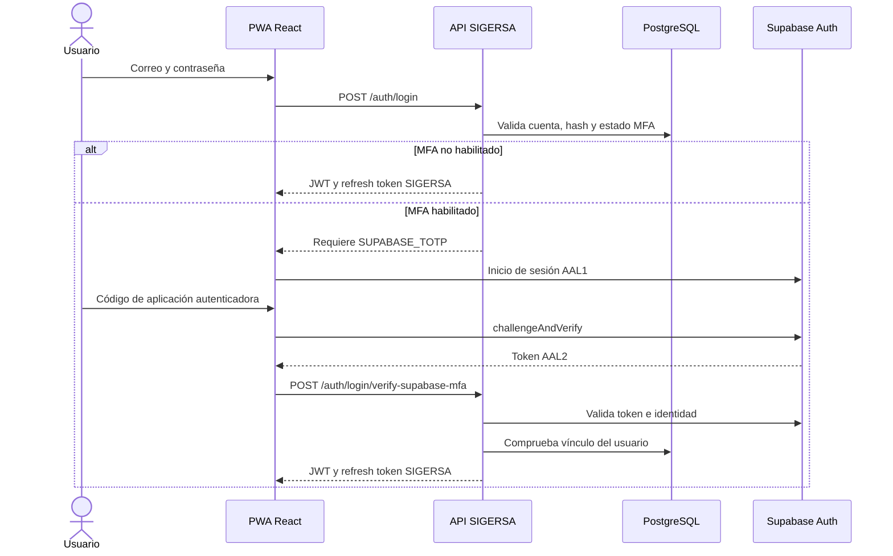
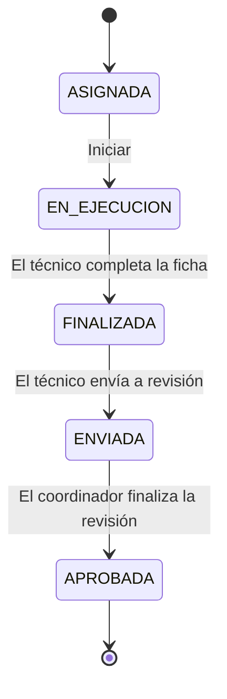

# SIGERSA — Sistema Integral de Gestión de Riesgo y Seguridad Alimentaria

SIGERSA es una aplicación web progresiva (PWA) para administrar de extremo a extremo las Evaluaciones Basadas en Riesgo y las inspecciones de Buenas Prácticas de Manufactura (EBR/BPM). Centraliza solicitudes, casos, programación, trabajo de campo, evidencias, hallazgos, correcciones, cálculo de riesgo, informes y trazabilidad histórica.

El desarrollo sigue **Spec-Driven Development (SDD)**. La línea base funcional combina `.sdd/specs/SRS-EBR-BPM.md` con `.sdd/specs/SRS-EBR-BPM-V2.md`; ante una contradicción, prevalece SRS V2.

## Estado actual

El sistema cuenta con frontend React y API .NET integrados, autenticación JWT con renovación de sesión, control de acceso por rol y ámbito, persistencia PostgreSQL mediante Dapper, almacenamiento privado de archivos en Supabase y soporte PWA/offline mediante IndexedDB.

Funcionalidades disponibles:

- Inicio y cierre de sesión, bloqueo por intentos y renovación del token.
- Recuperación de contraseña mediante OTP y MFA TOTP opcional con Supabase Auth.
- Registro público de Administrador de Empresa y Usuario Delegado con carta de autorización.
- Menú y rutas protegidas según rol; la API también valida empresa, asignación y propiedad.
- Gestión de empresas, establecimientos, usuarios, parámetros y catálogos.
- Solicitudes, casos, programación, evaluaciones con inspección integrada, hallazgos, evidencias y correcciones conectados a la API.
- Fichas BPM dinámicas, jerárquicas y versionadas.
- Riesgo, informes, auditoría, perfil y notificaciones.
- Cola offline idempotente para sincronizar respuestas y evidencias al recuperar conectividad.
- SweetAlert2, skeleton loading, máscaras dominicanas y validación visual de contraseñas.

Las integraciones reales de correo y Supabase requieren credenciales locales válidas. Sin SMTP habilitado no se enviarán códigos OTP; sin una clave secreta completa de Supabase el backend no podrá confirmar cargas en el bucket privado.

## Módulos y acceso por rol

Los módulos públicos son **Inicio de sesión**, **Registro** y **Recuperación de contraseña**. Todo usuario autenticado accede a **Resumen**, **Reportes**, **Mi perfil** y **Notificaciones y sincronización**.

| Módulo | Administrador | Administrador empresa | Usuario delegado | Coordinador | Técnico evaluador |
| --- | :---: | :---: | :---: | :---: | :---: |
| Resumen | ✓ | ✓ | ✓ | ✓ | ✓ |
| Solicitudes |  | ✓ | ✓ | ✓ |  |
| Alertas y denuncias |  |  |  | ✓ |  |
| Casos |  |  |  | ✓ |  |
| Programación |  |  |  | ✓ | ✓* |
| Evaluaciones e inspecciones |  |  |  | ✓ | ✓* |
| Establecimientos | ✓ |  |  |  |  |
| Hallazgos |  | ✓ | ✓ | ✓ | ✓* |
| Evidencias |  | ✓ | ✓ | ✓ | ✓* |
| Correcciones |  | ✓ | ✓ | ✓ | ✓* |
| Fichas BPM | ✓ |  |  |  |  |
| Reportes | ✓ | ✓ | ✓ | ✓ | ✓ |
| Empresas | ✓ |  |  |  |  |
| Gestión de usuarios | ✓ | ✓** |  |  |  |
| Parámetros | ✓ |  |  |  |  |
| Auditoría | ✓ |  |  |  |  |
| Mi perfil | ✓ | ✓ | ✓ | ✓ | ✓ |
| Notificaciones y sincronización | ✓ | ✓ | ✓ | ✓ | ✓ |

\* El Técnico Evaluador opera únicamente sobre recursos asignados.

\** El Administrador de Empresa solo administra usuarios de su propia empresa y no puede asignar roles internos o globales.

Los códigos canónicos son `ADMINISTRADOR`, `ADMINISTRADOR_EMPRESA`, `USUARIO_DELEGADO`, `COORDINADOR` y `TECNICO_EVALUADOR`.

### Evaluaciones e inspecciones: un solo módulo

El módulo **Evaluaciones** concentra el ciclo completo: creación, inicio, ejecución de la inspección, supervisión, revisión, aprobación y cierre. Una evaluación en estado `EN_EJECUCION` o `EN_CORRECCION` muestra **Realizar inspección** al técnico autorizado; después de finalizarse, el mismo acceso cambia a **Ver ficha** y queda en solo lectura. La antigua dirección del módulo Inspecciones se conserva como acceso compatible y conduce a Evaluaciones.



## Arquitectura y tecnologías

- **Frontend:** React 19, TypeScript 6, Vite 8, Tailwind CSS 4 y React Router DOM 7.
- **PWA/offline:** Service Worker, Dexie e IndexedDB con sincronización idempotente.
- **Backend:** .NET 10 Web API, Clean Architecture, REST y Problem Details.
- **Persistencia:** PostgreSQL 15+, Dapper y Npgsql.
- **Archivos:** Supabase Storage privado; PostgreSQL conserva metadatos y referencias.
- **Seguridad:** JWT, refresh tokens rotativos, MFA TOTP con Supabase Auth, hash de contraseñas y OTP, RBAC y ámbito.
- **Calidad:** xUnit, Vitest, Testing Library, ESLint, Prettier y OpenAPI/Swagger.

La solución backend contiene:

- `SIGERSA.Domain`: entidades, reglas e interfaces.
- `SIGERSA.Application`: casos de uso, contratos y validaciones.
- `SIGERSA.Infrastructure`: Dapper/Npgsql, repositorios, correo y Supabase.
- `SIGERSA.Api`: endpoints, autenticación, autorización, middleware y Swagger.
- `SIGERSA.Worker`: procesos en segundo plano.
- `SIGERSA.Tests`: pruebas automatizadas.

### Flujo de peticiones por módulo



### Persistencia de una evaluación y sus evidencias



### Alcance de la inspección y calificación



### Inicio de sesión con MFA opcional



### Ciclo de vida de una evaluación



> **Regla obligatoria:** todos los objetos de negocio de PostgreSQL pertenecen al esquema `SIGERSA`. No se crean tablas de negocio en `public` ni tipos `ENUM`; los catálogos administrables residen en `SIGERSA.ParametersControl`.

## Requisitos locales

- .NET SDK 10.
- Node.js compatible con Vite 8.
- pnpm 11.19 o compatible.
- PostgreSQL 15 o superior.
- Proyecto Supabase con Auth TOTP habilitado y bucket privado para probar archivos reales.
- Servidor SMTP para probar recuperación OTP y notificaciones.

Puertos predeterminados:

- Frontend: `http://127.0.0.1:5173`
- API: `http://localhost:5000`
- Swagger: `http://localhost:5000/swagger`
- PostgreSQL: `localhost:5432`

## Configuración local

### 1. Base de datos

```sql
CREATE DATABASE sigersa_db;
```

Aplique, en orden alfabético, las migraciones de `src/backend/Database/Migrations`. Actualmente existen 20, desde `001_initial_schema_sigersa.sql` hasta `020_inspection_qualification_policy.sql`. La API no las ejecuta automáticamente.

### 2. Backend

No guarde secretos reales en archivos versionados. Defínalos en `.env.local`, variables de entorno, User Secrets o un proveedor seguro. Ejemplo:

```powershell
$env:Database__ConnectionString = "Host=localhost;Port=5432;Database=sigersa_db;Username=postgres;Password=SU_CLAVE"
$env:Authentication__Jwt__SigningKey = "UNA_CLAVE_LOCAL_SEGURA_DE_AL_MENOS_32_CARACTERES"
$env:Supabase__Url = "https://SU_PROYECTO.supabase.co"
$env:Supabase__Key = "SU_CLAVE_SECRETA_COMPLETA_DEL_SERVIDOR"
$env:Supabase__DefaultBucketName = "SIGERSA_FILES"
$env:Smtp__Enabled = "true"
$env:Smtp__Host = "smtp.su-proveedor.com"
$env:Smtp__Port = "587"
$env:Smtp__EnableSsl = "true"
$env:Smtp__Username = "SU_USUARIO"
$env:Smtp__Password = "SU_CLAVE_SMTP"
$env:Smtp__FromAddress = "no-reply@su-dominio.com"
```

`Supabase__Key` es exclusiva del backend. Nunca exponga una clave de servicio en el navegador, Git, Swagger o los logs.

Para MFA, habilite el proveedor de correo/contraseña y la verificación TOTP en **Authentication** de Supabase. El servidor provisiona o actualiza la identidad externa; el navegador recibe únicamente la clave publicable y el usuario debe completar un desafío que produzca un token `aal2` antes de que SIGERSA emita su sesión.

### 3. Frontend

Copie `src/frontend/.env.example` como `src/frontend/.env.local` y complete únicamente valores públicos:

```dotenv
VITE_API_BASE_URL=http://127.0.0.1:5000
VITE_SUPABASE_URL=https://SU_PROYECTO.supabase.co
VITE_SUPABASE_PUBLISHABLE_KEY=SU_CLAVE_PUBLICABLE_O_ANON
VITE_SUPABASE_EVIDENCE_BUCKET=SIGERSA_FILES
```

La clave del frontend debe ser publicable o `anon`, nunca una clave secreta del servidor.

## Instalación y ejecución

### Ejecución rápida desde PowerShell

Abra PowerShell en la raíz del proyecto. La primera línea permite ejecutar los scripts requeridos solo durante la sesión actual de la terminal y elimina el bloqueo habitual de `pnpm.ps1`; no modifica permanentemente la política de Windows.

Backend:

```powershell
Set-ExecutionPolicy -Scope Process -ExecutionPolicy Bypass -Force
dotnet run --project src/backend/SIGERSA.Api --launch-profile http
```

Frontend, en otra ventana de PowerShell abierta en la raíz del proyecto:

```powershell
Set-ExecutionPolicy -Scope Process -ExecutionPolicy Bypass -Force
Set-Location src/frontend
pnpm dev --host 127.0.0.1 --port 5173
```

Si es la primera ejecución y aún no están instaladas las dependencias, ejecute una sola vez:

```powershell
Set-ExecutionPolicy -Scope Process -ExecutionPolicy Bypass -Force
dotnet restore src/backend/SIGERSA.sln --configfile NuGet.Config
Set-Location src/frontend
pnpm install
```

Después abra `http://127.0.0.1:5173/#/login`. La API estará en `http://localhost:5000` y Swagger en `http://localhost:5000/swagger`.

## Validación y pruebas

Backend:

```powershell
dotnet test src/backend/SIGERSA.sln
dotnet format src/backend/SIGERSA.sln --verify-no-changes
```

Frontend:

```powershell
cd src/frontend
pnpm format:check
pnpm lint
pnpm typecheck
pnpm test
pnpm build
```

Regeneración de OpenAPI después de compilar la API:

```powershell
dotnet tool restore
dotnet swagger tofile --output .sdd/specs/openapi-v1.json src/backend/SIGERSA.Api/bin/Debug/net10.0/SIGERSA.Api.dll v1
```

## Estructura del repositorio

```text
SIGERSA/
├── .sdd/
│   ├── architecture/          # Decisiones de arquitectura
│   ├── specs/                 # SRS, contratos, trazabilidad y OpenAPI
│   └── tests/                 # Evidencias y criterios de validación
├── docs/                      # Auditorías e informes
├── src/
│   ├── backend/
│   │   ├── Database/Migrations/
│   │   ├── SIGERSA.Api/
│   │   ├── SIGERSA.Application/
│   │   ├── SIGERSA.Domain/
│   │   ├── SIGERSA.Infrastructure/
│   │   ├── SIGERSA.Tests/
│   │   └── SIGERSA.Worker/
│   └── frontend/              # PWA React
└── tools/                     # Utilidades y smoke tests
```

## Especificaciones y trazabilidad

- `.sdd/specs/SRS-EBR-BPM.md`: especificación base.
- `.sdd/specs/SRS-EBR-BPM-V2.md`: línea base maestra y reglas prevalentes.
- `.sdd/specs/srs-functional-traceability.md`: trazabilidad funcional.
- `.sdd/specs/api-contracts.md`: contratos y permisos de API.
- `.sdd/specs/database-schema.md`: persistencia y migraciones.
- `.sdd/specs/openapi-v1.json`: contrato OpenAPI generado.
- `docs/RF-01-RF-20-audit.md`: cobertura funcional.

## Seguridad operacional

- No registre cuerpos, contraseñas, OTP, tokens, cadenas de conexión ni claves externas.
- Mantenga `.env.local` fuera del control de versiones.
- Use TLS en ambientes compartidos o productivos.
- Mantenga privados los buckets de Supabase y autorice cada carga desde la API.
- Mantenga el límite de cada evidencia en 5 MB tanto en el navegador como en la API.
- Para cuentas con MFA activado, la API solo emite la sesión después de validar un token Supabase `aal2` vinculado al mismo usuario.
- Use credenciales distintas por ambiente y rote cualquier secreto expuesto.
- Los errores HTTP se devuelven como `application/problem+json` sin detalles internos.
